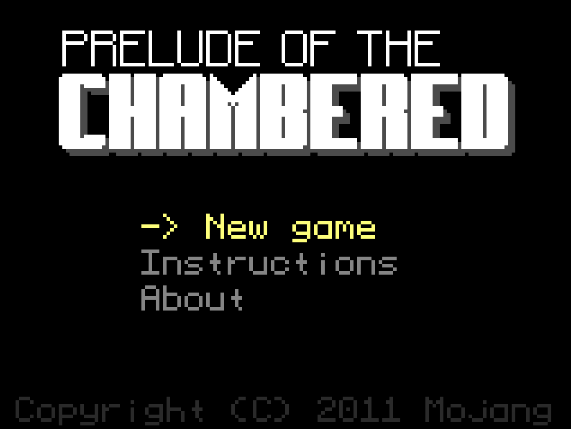

# Prelude of the Chambered: Reborn

A modern TypeScript/Vite port of **"Prelude of the Chambered"**, a retro first-person dungeon crawler originally created by Markus "Notch" Persson (creator of Minecraft) for Ludum Dare 21 in 2011.


[](https://github.com/Lingelo/prelude-of-the-chambered-reborn/actions/workflows/deploy.yml)

**[Play Now](https://lingelo.github.io/prelude-of-the-chambered-reborn/)**



## About the Game

Prelude of the Chambered is a first-person dungeon crawler with Wolfenstein 3D-style raycasting graphics. You wake up in a prison and must escape by exploring dungeons, solving puzzles, defeating enemies, and collecting items.

### Features

- 🎮 Classic raycasting 3D engine
- 🗝️ Multiple levels to explore (Prison, Dungeons, Overworld, Crypt, Temple, Ice Cave)
- ⚔️ Combat with various enemies (Bats, Ogres, Eyes, Ghosts + Boss variants)
- 🧩 Puzzle mechanics (pressure plates, switches, locked doors)
- 🎒 Collectible items (Power Glove, Pistol, Flippers, Cutters, Skates, Potions)
- 🏆 Win condition: Collect 4 keys and escape!

## Getting Started

### Prerequisites

- Node.js >= 18.0.0

### Installation

```bash
git clone https://github.com/Lingelo/prelude-of-the-chambered-reborn.git
cd prelude-of-the-chambered-reborn
npm install
```

### Development

```bash
npm run dev
```

Open http://localhost:5173 in your browser.

### Production Build

```bash
npm run build
npm run preview
```

## Controls

| Key | Action |
|-----|--------|
| `W` `A` `S` `D` | Move |
| `Q` `E` or `←` `→` | Turn |
| `Space` | Use item / Interact |
| `1` - `8` | Select item slot |
| `Esc` | Pause menu |

*Hold `Shift`/`Ctrl`/`Alt` + arrow keys for strafing*

## Tech Stack

- **TypeScript** - Type-safe JavaScript
- **Vite** - Fast build tool and dev server
- **HTML5 Canvas** - Software rendering (no WebGL)

## Project Structure

```
src/
├── main.ts              # Entry point
├── EscapeComponent.ts   # Game loop & asset loading
├── Game.ts              # Game state management
├── Art.ts               # Texture/sprite loading
├── Sound.ts             # Audio management
├── gui/                 # Rendering system
│   ├── Bitmap.ts        # 2D pixel buffer
│   ├── Bitmap3D.ts      # Raycasting renderer
│   ├── Screen.ts        # Screen compositor
│   └── Sprite.ts        # Billboard sprites
├── entities/            # Game entities
│   ├── Player.ts
│   ├── EnemyEntity.ts
│   └── ...
├── level/               # Level system
│   ├── Level.ts         # Base level class
│   ├── block/           # Block types
│   └── *Level.ts        # Specific levels
└── menu/                # Menu screens
```

## How It Works

This game uses **raycasting**, the same rendering technique popularized by Wolfenstein 3D (1992).

### Raycasting Explained

Unlike modern 3D engines that use polygons, raycasting renders a 2D map as a pseudo-3D view:

1. **Cast rays** from the player's position, one for each vertical column of the screen
2. **Find intersections** with walls by stepping through the grid
3. **Calculate distance** to determine wall height (closer = taller)
4. **Draw vertical strips** with textures sampled based on where the ray hit

The entire rendering is done in software on a 160x120 pixel buffer, then scaled up to the canvas - giving that authentic retro look.

### Key Files

- `src/gui/Bitmap3D.ts` - The raycasting renderer
- `src/gui/Sprite.ts` - Billboard sprites (enemies, items)
- `src/level/Level.ts` - Level data loaded from PNG images

## History

**Ludum Dare 21** (August 2011) - Theme: *"Escape"*

Markus "Notch" Persson, already famous for Minecraft, created this game in 48 hours. It showcased his ability to craft a complete, atmospheric dungeon crawler with:

- Custom raycasting engine in Java
- Original pixel art and sound effects
- Multiple levels with puzzles and boss fights
- A complete win condition

The game placed **1st in Audio** and ranked highly overall. It remains a beloved example of what's possible in a game jam.

**This Port** (2025)

Rewritten from scratch in TypeScript to:
- Run natively in modern browsers (no Java required)
- Preserve the original gameplay and atmosphere
- Use modern tooling (Vite, ESLint, TypeScript)

## Scripts

| Command | Description |
|---------|-------------|
| `npm run dev` | Start development server |
| `npm run build` | Build for production |
| `npm run preview` | Preview production build |
| `npm run typecheck` | Run TypeScript type checking |
| `npm run lint` | Run ESLint |
| `npm run lint:fix` | Fix ESLint errors |
| `npm run format` | Format code with Prettier |

## Troubleshooting

### No sound on game start

Modern browsers block autoplay audio. The game will play sounds after your first interaction (click or keypress).

### Game runs slowly

The game targets 60 FPS. If performance is poor:
- Close other browser tabs
- Disable browser extensions
- Try a different browser (Chrome/Firefox recommended)

### Controls not responding

Click on the game canvas to ensure it has focus.

## Contributing

Contributions are welcome! This project aims to faithfully preserve the original game - bug fixes and code improvements are appreciated, but new features that alter the core gameplay are outside the scope.

1. **Fork** the repository
2. **Create** a feature branch (`git checkout -b feature/amazing-feature`)
3. **Commit** your changes (`git commit -m 'Add amazing feature'`)
4. **Push** to the branch (`git push origin feature/amazing-feature`)
5. **Open** a Pull Request

### Development Tips

- Run `npm run typecheck` before committing
- Follow existing code style
- Test your changes in multiple browsers
- Reference the [original Java source](https://github.com/skeeto/Prelude-of-the-Chambered) when debugging

## Credits

### Original Game (2011)
- **Markus "Notch" Persson** - Game design, programming, art, audio
- **Mojang AB** - Publisher
- Created for **Ludum Dare 21** (Theme: "Escape")

### TypeScript Port (2025)
- **Angelo Lima** - Complete rewrite in TypeScript/Vite

### Resources
- [Original Java Source](https://github.com/skeeto/Prelude-of-the-Chambered) (archived by skeeto)
- [Ludum Dare Entry](https://web.archive.org/web/20190716042245/http://www.ludumdare.com/compo/ludum-dare-21/?action=preview&uid=398)

## License

MIT License - See [LICENSE](LICENSE) for details.

The original game assets and concept are © 2011 Mojang AB.
